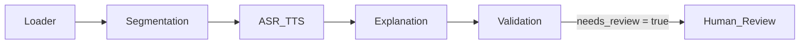

# MedVoiceQAReasonDataset

Transform [VQA‑RAD](https://huggingface.co/datasets/flaviagiammarino/vqa-rad) into a multi‑modal, explainable medical‑QA mini‑corpus (speech ✚ bounding box ✚ reasoning)

---

## ⭐️ What’s inside?

| Modality        | Fields                             | Source models/tools                       |
|-----------------|------------------------------------|-------------------------------------------|
| **Image**       | `image` (PNG)                      | VQA‑RAD DICOM → PNG via **dicom2png**     |
| **Speech**      | `speech_input` (WAV) · `asr_text`  | **Bark** (TTS) → **Na0s Whisper‑L** (ASR) |
| **Visual loc.** | `visual_box`                       | **Gemini 2 Flash** Vision (bbox‑only)     |
| **Reasoning**   | `text_explanation` · `uncertainty` | **Gemini 2 Flash** Language               |
| **QA flag**     | `needs_review` · `critic_notes`    | Gemini validation duo                     |

> **Size:** 300 samples covering CT/MRI/X‑ray, stratified by modality & question type.

---

## 🗺️ Pipeline (LangGraph)



*Each rectangle is a **Node** run by **LangGraph**; edges carry a single JSON blob.*

---

## 🚀 Quick Start

### 1 · Clone & install with uv

> [!NOTE
> If you have not installed `uv`, please do so first:
> [https://docs.astral.sh/uv/getting-started/installation/](https://docs.astral.sh/uv/getting-started/installation/)

```bash
git clone https://github.com/whats2000/MedVoiceQAReasonDataset.git
cd MedVoiceQAReasonDataset

# Check CUDA version
nvidia-smi
# It should show something like this:
# +-----------------------------------------------------------------------------------------+
# | NVIDIA-SMI 560.94                 Driver Version: 560.94         CUDA Version: 12.6     |
# |-----------------------------------------+------------------------+----------------------+

# Install with uv (Please pick the right one for your CUDA version)
uv sync --extra cpu
# Or if you using cuda 11.8
uv sync --extra cu118 
# Or if you using cuda 12.6
uv sync --extra cu126
# Or if you using cuda 12.8
uv sync --extra cu128
```

### 2 · Prepare secrets

Create an `.env` file with your Gemini & Hugging Face keys (see [.env.example](.env.example)):

### 3. Download VQA‑RAD index

```bash
uv run .\data\huggingface_loader.py
```

### 4 · Verify installation

```bash
uv run pytest
```

Outputs land in `runs/<timestamp>-<hash>/` with `manifest.json` for reproducibility.


### 5 · Dry‑run on 50 samples

```bash
uv run python pipeline/run_pipeline.py --limit 50
```

### 6 · Full 300‑sample run

```bash
uv run python pipeline/run_pipeline.py
```

---

## 🏗️ Repo layout

```
.
├── pipeline/          # Python graph definition (LangGraph API)
│   └── run_pipeline.py
├── nodes/             # one folder per Node (Loader, Segmentation, …)
├── data/              # sampling scripts & raw VQA‑RAD index
├── registry.json      # lists every Node impl, version, resources
├── runs/              # immutable artefacts  (git‑ignored)
└── README.md          # this file
```

---

## ⚙️ Node Registry & Hot‑Swap

* **registry.json** – declares every Node implementation, its semantic version, resource tags, maintainer.
* To swap a model:

  1. Add / update entry in `registry.json`.
  2. Point `run_pipeline.py` to the new `node_version`.
  3. Run CI (unit tests, 10‑sample smoke test, metric‑drift guard ±5 %).

No YAML involved—configuration is pure **Python + JSON**, making edits IDE‑friendly.

---

## 📝 Node Contracts

| Node         | Consumes                                 | Produces                                          |
| ------------ | ---------------------------------------- | ------------------------------------------------- |
| Loader       | `sample_id`                              | `image_path`, `text_query`                        |
| Segmentation | `image_path`, `text_query`               | `visual_box`                                      |
| ASR / TTS    | `text_query`                             | `speech_path`, `asr_text`, `speech_quality_score` |
| Explanation  | `image_path`, `text_query`, `visual_box` | `text_explanation`, `uncertainty`                 |
| Validation   | *all prior keys*                         | `needs_review`, `critic_notes`                    |

Each Node appends `node_name` and `node_version` for full provenance.

---

## 🎯 Quality Targets

| Field              | Metric                   | Pass       |
|--------------------|--------------------------|------------|
| `visual_box`       | IoU vs. RSNA / human box | **> 0.50** |
| `text_explanation` | BERTScore F1             | **> 0.85** |
| Consistency        | 5× self‑consistency      | **≥ 80%**  |
| Overall            | `needs_review = false`   | **≥ 80%**  |

Failing samples enter the `Human_Review` branch for manual triage.

---

## 🔄 Update Models in Five Steps

1. Train or fine‑tune the new model.
2. Wrap it to match the Node I/O JSON schema.
3. Register version in `registry.json`.
4. Edit `run_pipeline.py` to use the new version.
5. Re‑run tests; if metrics pass → merge.

---

## 📜 License & Citation

* Code: MIT
* Derived data: CC‑BY 4.0  (VQA‑RAD is CC0 1.0; please cite their paper.)

```bibtex
@dataset{medvoiceqa_2025,
  title   = {MedVoiceQAReasonDataset},
  year    = {2025},
  url     = {https://github.com/whats2000/MedVoiceQAReasonDataset}
}
```

---

## ✨ Acknowledgements

* VQA‑RAD authors for the base dataset.
* Open‑source medical‑AI community for Whisper‑L, Bark, LangGraph, and Gemini credits.
